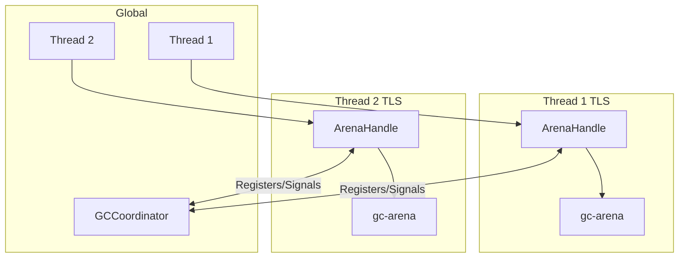
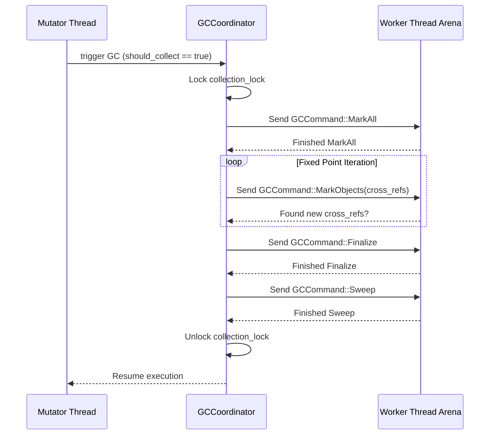

# Garbage Collection and Memory Safety

This document describes the garbage collection subsystem, memory safety invariants, and the cross-arena reference tracking system.

## Overview

`dotnet-rs` uses `gc-arena` as its underlying GC, extended with a custom **Stop-The-World (STW) coordinator** for multi-arena (multi-threaded) collection. The GC subsystem spans multiple crates:

- **`dotnet-vm/src/gc/`**: Coordinator and arena management
- **`dotnet-vm/src/memory/`**: Heap manager, raw memory access, memory ops
- **`dotnet-value/src/object.rs`**: Heap object representation
- **`dotnet-value/src/storage.rs`**: Field storage with atomic capabilities
- **`dotnet-utils/src/lib.rs`**: `BorrowGuard` and `BorrowScopeOps`
- **`dotnet-utils/src/gc.rs`**: GC utility types and `GCCommand`

## Arena Architecture

### Per-Thread Arenas
Each thread owns a `GCArena` stored in thread-local storage (`gc/arena.rs` → `THREAD_ARENA`). The `Executor` manages the arena lifecycle:
- Arena is created in `Executor::new` and stored in `THREAD_ARENA`
- `Executor::with_arena` provides mutable access for GC mutations
- On `Drop`, the executor performs a final full GC and removes the arena

### `GCCoordinator` (`gc/coordinator.rs`)

Two implementations are selected via the `multithreading` feature flag:

**Multi-threaded (`cfg(feature = "multithreading")`)**:
- Tracks all arena handles via `register_arena`/`unregister_arena`.
- Monitors allocation pressure via `ArenaHandleInner::record_allocation`. If `allocation_counter + size > ALLOCATION_THRESHOLD`, sets a `needs_collection` flag. The coordinator checks this flag in `should_collect`.
- Orchestrates STW collection via `collect_all_arenas` using a phase-based approach:
  1. **Phase 1 (MarkAll)**: Acquires collection lock, clears cross-arena references table, and sends `MarkAll` to all arenas.
  2. **Phase 2 (Fixed-point MarkObjects)**: Repeatedly sends `MarkObjects` commands for cross-arena references discovered during marking. Iterates until no new cross-arena references are found.
  3. **Phase 3 (Finalize)**: Sends `Finalize` command to run finalizers on unreachable objects.
  4. **Phase 4 (Sweep)**: Sends `Sweep` to all arenas to reclaim dead objects.

**Single-threaded (`cfg(not(feature = "multithreading"))`)**:
- Stub implementation — `should_collect` always returns false (relies on `gc-arena`'s own local collection).
- No cross-arena tracking needed.

### `GCCommand` enum
Defined in `dotnet_utils::gc::GCCommand`:
- `MarkAll`: Start marking phase, trace all local roots in the arena.
- `MarkObjects(HashSet<usize>)`: Trace specific opaque object pointers (cross-arena refs).
- `Finalize`: Run finalizers for dead objects.
- `Sweep`: Reclaim unreachable objects.

## Cross-Arena Reference Tracking

When an object in arena A stores a reference to an object in arena B, this must be tracked so arena B's collector doesn't reclaim the referenced object prematurely.

### How References Are Recorded
- Memory mutations occur through `RawMemoryAccess` (`memory/access.rs`).
- `RawMemoryAccess::perform_write` (and unaligned/atomic equivalents) checks the `ArenaId` of the written `ObjectRef` or `ManagedPtr` against the destination `MemoryOwner`.
- If a cross-arena scenario is detected, it calls `record_objref_cross_arena` or `record_managedptr_cross_arena`.
- Bulk operations like block copying (`initblk`, `cpblk`) use `record_refs_recursive` and `record_refs_in_range` to scan the layout's GC descriptor and record any contained references.

### How They're Used During Collection
- During the STW mark phase, the marking thread sets a TLS flag via `set_currently_tracing(Some(thread_id))`.
- When cross-arena refs are scanned during this tracing phase, instead of storing them globally, they are collected locally in a TLS buffer (`FOUND_CROSS_ARENA_REFS`).
- The coordinator then collects these refs via `take_found_cross_arena_refs()`.
- The coordinator then dispatches `GCCommand::MarkObjects(ptrs)` to the respective target arenas owning the objects to resurrect them for the current GC cycle.

## BorrowGuard and Deadlock Prevention

### The Problem
`gc-arena` requires exclusive access to an arena for collection. If a thread holds a borrow on a heap object (via `Gc::borrow`) when STW is requested, it cannot release the arena, leading to a deadlock. Furthermore, traversing the heap during a STW pause while mutator threads hold locks can also cause deadlocks.

### The Solution: `BorrowGuard` (`dotnet-utils/src/lib.rs`)
- `BorrowScopeOps` trait: `enter_borrow_scope()` / `exit_borrow_scope()`
- `BorrowGuard::new(ctx)` increments a counter; when `counter > 0`, `check_gc_safe_point` immediately returns `false` without blocking or polling the thread manager.
- RAII — `Drop` decrements the counter.
- **`data_ptr()` Tracing**: During the STW pause, `gc-arena` tracing callbacks use `raw_data_ptr()` or `data_ptr()` to read object fields, directly bypassing `ThreadSafeLock` checks. This is safe because all mutator threads are suspended.

### Rules (enforced by convention, not compiler)
1. Never call `check_gc_safe_point()` while holding a heap borrow.
2. Never allocate while holding a heap borrow (allocation may trigger GC).
3. Always use `BorrowGuard` when borrowing heap objects in instruction handlers/intrinsics.
4. Chunk large operations — e.g., in `string_ops.rs`, `span.rs`, or `unsafe_ops.rs`, long loops check `ctx.check_gc_safe_point()` periodically (e.g. every 1024 iterations or similar block size), dropping and re-acquiring `BorrowGuard` between iterations.

## HeapManager (`memory/heap.rs` & `memory/ops.rs`)

The `HeapManager` tracks object lifetimes, registration, and finalization:
- **Finalization**: Scans registered objects during `finalize_check` and queues unreachable ones with finalizers to a finalizer thread/queue.
- Coordinates with `memory/ops.rs` (`MemoryOps` trait) which abstracts concrete allocation paths (`new_object`, `new_vector`, `box_value`).
- Maintains an `OBJECT_REGISTRY` of known heap objects, facilitating robust pointer validation.

## RawMemoryAccess (`memory/access.rs`)

A critical abstraction (~1038 lines) providing memory safety over unsafe heap storage. Operations include:
- **Unaligned reads/writes**: Validates reads/writes matching the `unaligned.` CIL prefix against `LayoutManager` invariants.
- **Atomic operations**: Compare-exchange, exchange, load, store. Respects .NET memory models (`Ordering` abstractions).
- **Bounds checking**: `check_bounds_internal` validates pointer arithmetic against `base` and `len`.
- **Reference integrity**: `validate_ref_integrity` ensures GC reference slots aren't partially overwritten (e.g. by overlapping struct copies).
- **Cross-arena tracking**: Checks all reference stores.
- **`MemoryOwner`**: Enum over `Local(ObjectRef<'gc>)` and `CrossArena(ObjectPtr, ArenaId)` — dynamically routes read/writes through `gc-arena` mutations or thread-safe atomic views.

## FieldStorage (`dotnet-value/src/storage.rs`)

Provides atomic-capable raw byte storage for object fields:
- Backed by `Vec<u8>`.
- Supports synchronised/atomic field access (`get_field_atomic`, `set_field_atomic`) under various memory ordering models.
- Provides `raw_data_ptr()` returning `*mut u8` for low-level or STW-GC tracing access.

## Object Representation (`dotnet-value/src/object.rs`)

Heap objects are represented via several layers of abstraction (~1180 lines):
- **`HeapStorage`**: Enum holding distinct memory models: `Vec(Vector)`, `Obj(Object)`, `Str(CLRString)`, `Boxed(Object)`.
- **`ObjectInner`**: Wraps `HeapStorage` alongside the `owner_id: ArenaId`. When `feature = "memory-validation"` is enabled, embeds a `magic` number (`0x5AFE_0B1E_C700_0000`).
- **`ObjectPtr`**: A transparent, Send/Sync wrapper over a raw pointer to a `ThreadSafeLock<ObjectInner>`. Used primarily for cross-arena references.
- **`ObjectRef`**: A GC-managed handle wrapping the `ThreadSafeLock`. Implements `PointerLike` and `Collect`.
- Header layout delegates to `LayoutManager` logic but inherently stores the synchronization block index and type description pointer in the .NET-compliant object header.

## GC Collect Trait Implementations

All types stored in the GC heap or referenced by the VES stack must implement `gc_arena::Collect`:
- **`unsafe_empty_collect!`**: Used for leaf types that contain no further GC references (e.g. primitive wrappers, basic configs).
- **Manual Implementations**: Complex types like `ObjectRef`, `HeapStorage`, and `ValueType` manually implement the `trace(&self, cc: &Collection)` method. The `Collect` implementations iterate through all child elements, calling `.trace(cc)` recursively to maintain the GC reachability graph.