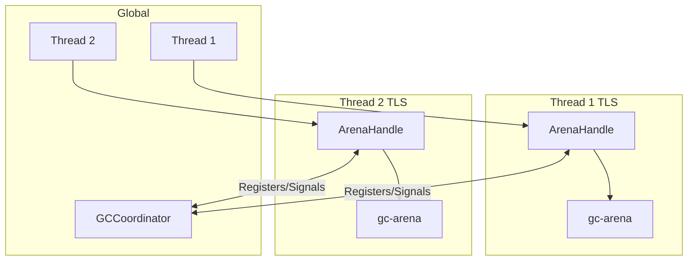
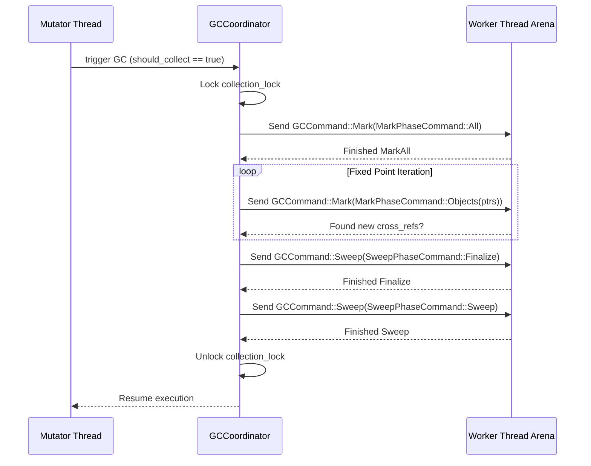

# Garbage Collection and Memory Safety

This document describes the garbage collection subsystem, memory safety invariants, and the cross-arena reference tracking system.

## Overview

`dotnet-rs` uses `gc-arena` as its underlying GC, extended with a custom **Stop-The-World (STW) coordinator** for multi-arena (multi-threaded) collection. The GC subsystem spans multiple crates:

- **`dotnet-vm/src/gc/`**: Coordinator and arena management
- **`dotnet-vm/src/memory/`**: Heap manager, raw memory access, memory ops
- **`dotnet-value/src/object/`**: Heap object representation (`mod.rs`, `heap_storage.rs`, `types.rs`)
- **`dotnet-value/src/storage.rs`**: Field storage with atomic capabilities
- **`dotnet-utils/src/lib.rs`**: `GcScopeGuard<'ctx>` (legacy alias: `BorrowGuardHandle<'ctx>`) and `BorrowScopeOps`
- **`dotnet-utils/src/gc/`**: GC utility types (`mod.rs`), `GCCommand`, `ThreadSafeLock` (`thread_safe_lock.rs`), arena helpers (`arena.rs`), and cross-arena refs (`cross_arena.rs`)

## Arena Architecture

### Per-Thread Arenas
Each thread owns a `GCArena` stored in thread-local storage (`gc/arena.rs` → `THREAD_ARENA`). The `Executor` manages the arena lifecycle:
- Arena is created in `Executor::new` and stored in `THREAD_ARENA`
- `Executor::with_arena` provides mutable access for GC mutations
- On `Drop`, the executor performs a final full GC and removes the arena

```mermaid
graph TD
    subgraph Global
        C[GCCoordinator]
        T1[Thread 1]
        T2[Thread 2]
    end
    
    subgraph "Thread 1 TLS"
        A1[ArenaHandle]
        GCA1[gc-arena]
    end
    
    subgraph "Thread 2 TLS"
        A2[ArenaHandle]
        GCA2[gc-arena]
    end
    
    T1 --> A1
    T2 --> A2
    A1 --> GCA1
    A2 --> GCA2
    A1 <-->|Registers/Signals| C
    A2 <-->|Registers/Signals| C
```

### `GCCoordinator` (`gc/coordinator.rs`)

Two implementations are selected via the `multithreading` feature flag:

**Multi-threaded (`cfg(feature = "multithreading")`)**:
- Tracks all arena handles via `register_arena`/`unregister_arena`.
- Monitors allocation pressure via `ArenaHandleInner::record_allocation`. If `allocation_counter + size > ALLOCATION_THRESHOLD`, sets a `needs_collection` flag. The coordinator checks this flag in `should_collect`.
- Uses a lock-backed RAII session model:
  - `begin_collection()` acquires the coordinator lock and yields `CollectionSession`.
  - While `CollectionSession` is alive, collecting-only operations (command dispatch / wait / fixed-point marking) flow through the session.
  - `finish()` ends the session; dropping a still-live `CollectionSession` also restores Idle state (`stw_in_progress=false`, lock released).
- Orchestrates STW collection via `CollectionSession::collect_all_arenas` using a phase-based approach:
  1. **Phase 1 (MarkAll)**: Acquires collection lock, clears cross-arena references table, and sends `GCCommand::Mark(MarkPhaseCommand::All)` to all arenas.
  2. **Phase 2 (Fixed-point MarkObjects)**: Repeatedly sends `GCCommand::Mark(MarkPhaseCommand::Objects(…))` for cross-arena references discovered during marking. Iterates until no new cross-arena references are found.
  3. **Phase 3 (Finalize)**: Sends `GCCommand::Sweep(SweepPhaseCommand::Finalize)` to run finalizers on unreachable objects.
  4. **Phase 4 (Sweep)**: Sends `GCCommand::Sweep(SweepPhaseCommand::Sweep)` to all arenas to reclaim dead objects.

**Single-threaded (`cfg(not(feature = "multithreading"))`)**:
- Stub implementation — `should_collect` always returns false (relies on `gc-arena`'s own local collection).
- No cross-arena tracking needed.

### `GCCommand` enum
Defined in `dotnet_utils::gc::GCCommand`, split into two phase-typed inner enums:
- `Mark(MarkPhaseCommand)`:
  - `MarkPhaseCommand::All` — start marking phase, trace all local roots in the arena.
  - `MarkPhaseCommand::Objects(MarkObjectPointers)` — trace specific typed cross-arena object pointers.
- `Sweep(SweepPhaseCommand)`:
  - `SweepPhaseCommand::Finalize` — run finalizers for dead objects.
  - `SweepPhaseCommand::Sweep` — reclaim unreachable objects.

```mermaid
sequenceDiagram
    participant T as Mutator Thread
    participant C as GCCoordinator
    participant W as Worker Thread Arena

    T->>C: trigger GC (should_collect == true)
    C->>C: Lock collection_lock
    C->>W: Send GCCommand::Mark(MarkPhaseCommand::All)
    W-->>C: Finished MarkAll
    
    loop Fixed Point Iteration
        C->>W: Send GCCommand::Mark(MarkPhaseCommand::Objects(ptrs))
        W-->>C: Found new cross_refs?
    end
    
    C->>W: Send GCCommand::Sweep(SweepPhaseCommand::Finalize)
    W-->>C: Finished Finalize
    
    C->>W: Send GCCommand::Sweep(SweepPhaseCommand::Sweep)
    W-->>C: Finished Sweep
    
    C->>C: Unlock collection_lock
    C-->>T: Resume execution
```

## Cross-Arena Reference Tracking

When an object in arena A stores a reference to an object in arena B, this must be tracked so arena B's collector doesn't reclaim the referenced object prematurely.

### Arena Liveness and Generation Tracking (`dotnet-utils/src/gc/cross_arena.rs`)

Cross-arena registration is backed by `ArenaState` entries in a global registry:

- `ArenaState` contains `stw_in_progress`, `active_leases`, `is_alive`, and a monotonically increasing `generation`.
- `try_acquire_lease(arena_id)` returns an `ArenaLease` guard that increments `active_leases`.
- `unregister_arena` removes the entry, flips `is_alive`, then waits until `active_leases == 0` before returning.

This closes the dereference TOCTOU window because in-flight dereferences hold a lease while reading cross-arena pointers.

Recorded cross-arena references are generation-stamped as `(arena_id, raw_ptr, generation)`. At harvest, callers reacquire a lease and compare `lease.generation()` with the recorded generation; mismatches are discarded as stale pointers after unregister/re-register cycles.

### How References Are Recorded
- Memory mutations occur through `RawMemoryAccess` (`memory/access.rs`).
- `RawMemoryAccess::write_value_internal` (and unaligned/atomic equivalents) checks the `ArenaId` of the written `ObjectRef` or `ManagedPtr` against the destination `MemoryOwner`.
- If a cross-arena scenario is detected, it calls `record_objref_cross_arena` or `record_managedptr_cross_arena`.
- Bulk operations like block copying (`initblk`, `cpblk`) use `record_refs_recursive` and `record_refs_in_range` to scan the layout's GC descriptor and record any contained references.

### Weak References
The VM supports `GCHandleType::Weak` and `WeakTrackResurrection` (§I.8.2.4).
- **Implementation**: `HeapManager::finalize_check` zero-fills weak handles for objects that are unreachable and don't require (or have finished) finalization.
- **BCL Support**: `System.WeakReference<T>` is currently not in the BCL support library and must be defined by the user or added to `support.dll`.
- **Cross-Arena Limitation**: The current `GCCoordinator` fixed-point iteration only resurrects strong references. Weak references across arenas are not currently tracked or zeroed correctly by the global coordinator. This is a known limitation for multi-threaded scenarios.

## GcScopeGuard and Deadlock Prevention

### The Problem
`gc-arena` requires exclusive access to an arena for collection. If a thread holds a borrow on a heap object (via `Gc::borrow`) when STW is requested, it cannot release the arena, leading to a deadlock. Furthermore, traversing the heap during a STW pause while mutator threads hold locks can also cause deadlocks.

### The Solution: `GcScopeGuard<'ctx>` (`dotnet-utils/src/lib.rs`)
- `BorrowScopeOps` trait (GC scope API): `enter_gc_scope()` / `exit_gc_scope()` / `active_gc_scope_depth()`.
- `GcScopeGuard<'ctx>` is an owner-carrying RAII guard (legacy alias: `BorrowGuardHandle<'ctx>`). The lifetime parameter `'ctx` ties the guard to the lifetime of the `BorrowScopeOps` context, preventing use-after-free at compile time.
- Construct via `GcScopeGuard::enter(ctx, token)` — increments the GC scope counter; when `counter > 0`, `check_gc_safe_point` immediately returns `false` without blocking or polling the thread manager.
- RAII — `Drop` decrements the counter.
- **`data_ptr()` Tracing**: During the STW pause, `gc-arena` tracing callbacks use `raw_data_ptr()` or `data_ptr()` to read object fields, directly bypassing `ThreadSafeLock` checks. This is safe because all mutator threads are suspended.

### Rules (enforced by convention, not compiler)
1. Never call `check_gc_safe_point()` while holding a heap borrow.
2. Never allocate while holding a heap borrow (allocation may trigger GC).
3. Always use `GcScopeGuard::enter(ctx, token)` when holding heap borrows in instruction handlers/intrinsics.
4. Chunk large operations — e.g., in `string_ops/`, `span/`, or `unsafe_ops/`, long loops check `ctx.check_gc_safe_point()` periodically (e.g. every 1024 iterations or similar block size), dropping and re-acquiring `GcScopeGuard` between iterations.

## Panic-Safety Guarantees During STW

`ThreadManager::request_stop_the_world` uses a `ResumeOnPanic` guard (`crates/dotnet-vm/src/threading/basic.rs`) that calls `resume_threads()` if any panic occurs before ownership is handed to `StopTheWorldGuard`. This prevents mutator threads from being left permanently paused.

`CommandCompletionGuard` in `crates/dotnet-vm/src/gc/coordinator.rs` is typestated (`Armed`/`Disarmed`):
- In `Armed` state, `Drop` calls `command_finished`.
- `disarm(self)` consumes the guard and returns `Disarmed`, whose `Drop` is a no-op.
- This guarantees exactly one completion signal on panic paths and avoids duplicate completion on normal paths.

Write-barrier TLS buffers are drained on unwind by `WriteBarrierFlushGuard` (`crates/dotnet-vm/src/memory/access.rs`), a zero-sized RAII guard placed at each write-barrier drain site. Its `Drop` impl flushes `WB_LOCAL_BUF` regardless of whether the enclosing operation completes normally or unwinds.

## HeapManager (`memory/heap.rs` & `memory/ops.rs`)

The `HeapManager` tracks object lifetimes, registration, and finalization:
- **Finalization**: Scans registered objects during `finalize_check` and queues unreachable ones with finalizers to a finalizer thread/queue.
- Coordinates with `memory/ops.rs` (`MemoryOps` trait) which abstracts concrete allocation paths (`new_object`, `new_vector`, `box_value`).
- Maintains an `OBJECT_REGISTRY` of known heap objects, facilitating robust pointer validation.

## RawMemoryAccess (`memory/access.rs`)

A critical abstraction (~1090 lines) providing memory safety over unsafe heap storage. The core implementations are `read_value_internal` and `write_value_internal`, which handle the actual data transfer and reference tracking. Higher-level APIs like `write_to_heap` and `write_to_unmanaged` provide additional safety checks and bounds validation. Operations include:
- **Unaligned reads/writes**: Validates reads/writes matching the `unaligned.` CIL prefix against `LayoutManager` invariants.
- **Atomic operations**: Compare-exchange, exchange, load, store. Respects .NET memory models (`Ordering` abstractions).
- **Bounds checking**: `check_bounds_internal` validates pointer arithmetic against `base` and `len`.
- **Reference integrity**: `validate_ref_integrity` ensures GC reference slots aren't partially overwritten (e.g. by overlapping struct copies).
- **Cross-arena tracking**: Checks all reference stores.
- **`MemoryOwner`**: Enum over `Local(ObjectRef<'gc>)` and `CrossArena(ObjectPtr, ArenaId, GcLifetime<'gc>)` — dynamically routes read/writes through `gc-arena` mutations or thread-safe atomic views. The `GcLifetime<'gc>` token in `CrossArena` ties the owner to a real GC context, preventing weaker-lifetime construction.

## FieldStorage (`dotnet-value/src/storage.rs`)

Provides atomic-capable raw byte storage for object fields:
- Backed by `Vec<u8>`.
- Supports synchronised/atomic field access (`get_field_atomic`, `set_field_atomic`) under various memory ordering models.
- Provides `raw_data_ptr()` returning `*mut u8` for low-level or STW-GC tracing access.

## Object Representation (`dotnet-value/src/object/`)

Heap objects are represented via several layers of abstraction, split across `mod.rs` (~600 lines), `heap_storage.rs`, and `types.rs`:
- **`HeapStorage`**: Enum holding distinct memory models: `Vec(Vector)`, `Obj(Object)`, `Str(CLRString)`, `Boxed(Object)`.
- **`ObjectInner`**: Wraps `HeapStorage` alongside the `owner_id: ArenaId`. When `feature = "memory-validation"` is enabled, embeds a `magic` number (`0x5AFE_0B1E_C700_0000`).
- **`ObjectPtr`**: A transparent, Send/Sync wrapper over a raw pointer to a `ThreadSafeLock<ObjectInner>`. Used primarily for cross-arena references.
- **`ObjectRef`**: A GC-managed handle wrapping the `ThreadSafeLock`. Implements `PointerLike` and `Collect`.
- Header layout delegates to `LayoutManager` logic but inherently stores the synchronization block index and type description pointer in the .NET-compliant object header.

## GC Collect Trait Implementations

All types stored in the GC heap or referenced by the VES stack must implement `gc_arena::Collect`:
- **`#[derive(Collect)]`**: Used for types where automatic tracing of all fields is sufficient (e.g., `ObjectInner`). The `#[collect(no_drop)]` attribute is often used to ensure safety.
- **`static_collect!`**: Used for leaf types that contain no further GC references (e.g. primitive wrappers, basic configs).
- **Manual Implementations**: Complex types with specialized tracing logic (like cross-arena reference tracking in `ObjectRef`) or those requiring custom validation manually implement the `trace<Tr: Trace<'gc>>(&self, cc: &mut Tr)` method. The `Collect` implementations iterate through all child elements, calling `.trace(cc)` recursively to maintain the GC reachability graph.

## Upstream Crate Contributor Notes

### `gc-arena`: Mutation Token and `'gc` Branding Guarantees

**Source reference:** `gc-arena` (pinned rev `75671ae`), `src/arena.rs:163-187`.

`gc-arena` enforces memory safety through two complementary mechanisms that every contributor working near the GC boundary must understand:

#### Mutation Token (`&Mutation<'gc>`)
All GC-managed allocation and reference writes require a `&Mutation<'gc>` token, which is only issued inside an `Arena::mutate(|mutation, root| { ... })` closure. This token proves that the arena is not currently being collected and that it is valid to allocate into or update `Gc<'gc, T>` handles.

Rules:
- **Never store the `&Mutation<'gc>` token or any value derived from it outside the `mutate` closure.** The `'gc` lifetime is invariant and is scoped to the closure; Rust enforces this for safe code. Unsafe cross-arena paths must compensate manually.
- **`ThreadSafeLock<T>` and the mutation token**: In single-threaded mode, `ThreadSafeLock<T>` wraps `gc_arena::RefLock<T>` — `borrow_mut` requires a `&Mutation<'gc>` witness. In multi-threaded mode it wraps `parking_lot::RwLock<T>` and does not require the token for locking, but the caller is still responsible for ensuring no collection is in progress (enforced structurally by the STW protocol). The two code paths are gated by `#[cfg(feature = "multithreading")]` in `crates/dotnet-utils/src/gc/thread_safe_lock.rs`.
- **STW tracing callbacks** bypass `ThreadSafeLock` checks and read object fields via `raw_data_ptr()` / `data_ptr()` directly. This is safe only because all mutator threads are suspended at a safe point before tracing begins.

#### `'gc` Lifetime Branding
Every `Gc<'gc, T>` handle is branded with the invariant `'gc` lifetime of the arena that owns it. This prevents handles from outliving their arena or being compared across different arenas at compile time.

Rules:
- **Cross-arena references cannot be expressed as `Gc<'gc, T>`.** They are represented as `ObjectPtr` (a raw pointer) paired with an `ArenaId` and a `GcLifetime<'gc>` token (see `MemoryOwner::CrossArena` in `crates/dotnet-vm/src/memory/access.rs`). The `GcLifetime<'gc>` token can only be minted from a live `GCHandle<'gc>`, preserving the `'gc` branding invariant for cross-arena owners.
- **`GcLifetime<'gc>` forgery is prohibited.** The token has a private constructor and is only issued by `GCHandle::lifetime()` (`crates/dotnet-utils/src/gc/mod.rs`). Any code that needs to construct a `MemoryOwner::CrossArena` must obtain a real `GCHandle<'gc>` first.
- **Unsafe cross-arena dereferences** must call `validate_magic()` and `validate_arena_id()` on `ObjectInner` before reading any fields (enforced in `ObjectPtr::as_heap_storage` and `ObjectRef::as_heap_storage`). These checks are always active in debug builds and selectively active under the `memory-validation` feature in release builds.
