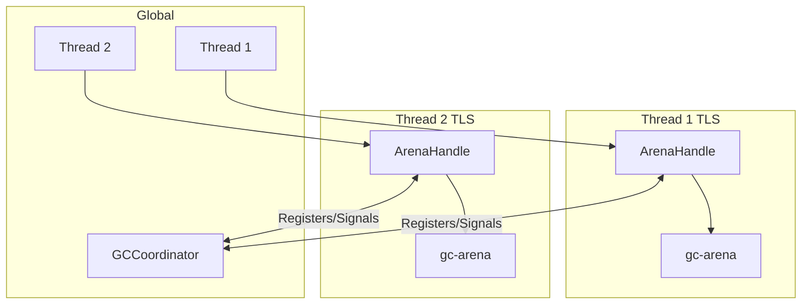
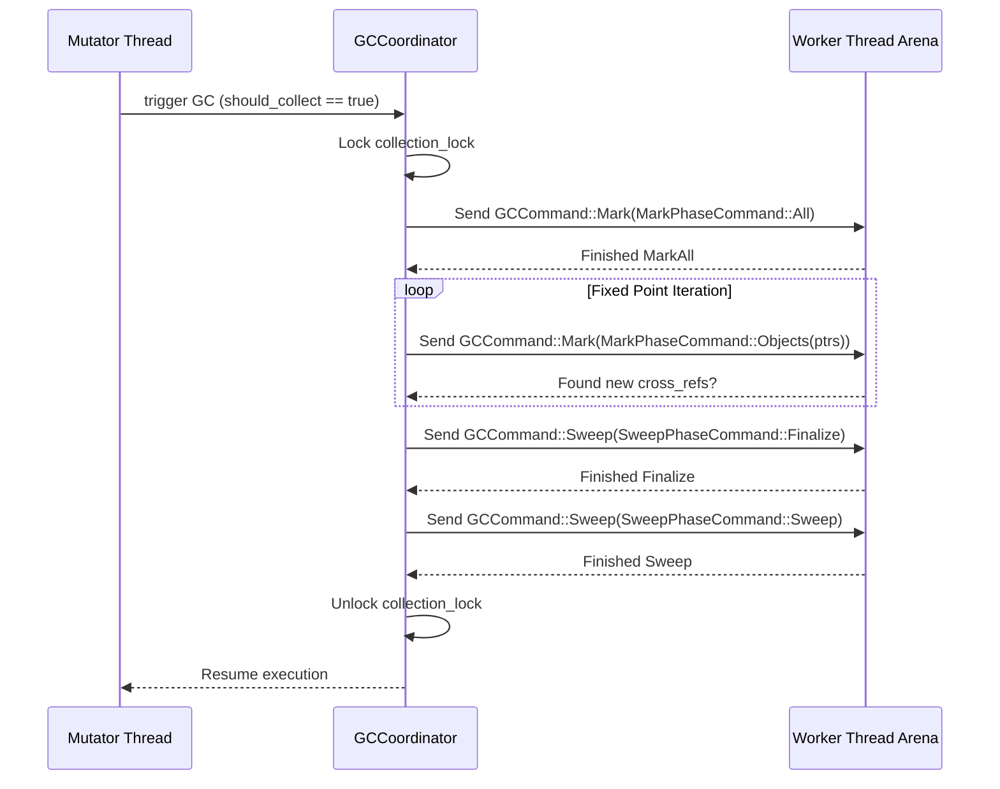

# Garbage Collection and Memory Safety

This document describes the garbage collection subsystem, memory safety invariants, and the cross-arena reference tracking system.

## Overview

`dotnet-rs` uses `gc-arena` as its underlying GC, extended with a custom **Stop-The-World (STW) coordinator** for multi-arena (multi-threaded) collection. The GC subsystem spans multiple crates:

- **`dotnet-vm/src/gc/`**: Coordinator and arena management
- **`dotnet-runtime-memory/src/`**: Heap manager, raw memory access, and memory ops
- **`dotnet-value/src/object/`**: Heap object representation (`mod.rs`, `heap_storage.rs`, `types.rs`)
- **`dotnet-value/src/storage.rs`**: Field storage with atomic capabilities
- **`dotnet-utils/src/lib.rs`**: `GcScopeGuard<'ctx>` and `BorrowScopeOps`
- **`dotnet-utils/src/gc/`**: GC utility types (`mod.rs`), `GCCommand`, `ThreadSafeLock` (`thread_safe_lock.rs`), arena helpers (`arena.rs`), and cross-arena refs (`cross_arena.rs`)

## Invariants

- `F1.StwParked`: GC-only raw accesses require a `StopTheWorldGuard`/`GcCycleGuard` pause in which every relevant mutator is parked.
- `F1.ArenaGenerationMatch`: cross-arena accesses hold an `ArenaLease` and compare its generation with the recorded generation; `unregister_arena` waits for active leases.
- `F1.GcHandleRooted`: raw access through a GC reference remains rooted by its `Gc<'gc>` handle, lock guard, or live lease for the full access.
- `F5.TracesEveryGcRef`: every unsafe `Collect` implementation enumerates every contained GC handle through its fields and variants.
- `F6.NoEscapeAcrossArena`: arena branding, private constructors, and `for<'gc>` confinement prevent `'gc` values from escaping; the deliberate cross-arena `Gc::from_ptr` path is limited to tracing and cannot escape.
- `F9.MetadataArenaOutlivesDescriptors`: owner-tied `Arc<MetadataArena>` metadata keeps leaked descriptor allocations alive for all descriptor users.

## Arena Architecture

### Per-Thread Arenas
Each thread owns a `GCArena` stored in thread-local storage (`gc/arena.rs` → `THREAD_ARENA`). The `Executor` manages the arena lifecycle:
- Arena is created in `Executor::new` and stored in `THREAD_ARENA`
- `Executor::with_arena` provides mutable access for GC mutations
- On `Drop`, the executor performs a final full GC and removes the arena

```mermaid
graph TD
    subgraph Global
        C[GCCoordinator]
        T1[Thread 1]
        T2[Thread 2]
    end
    
    subgraph "Thread 1 TLS"
        A1[ArenaHandle]
        GCA1[gc-arena]
    end
    
    subgraph "Thread 2 TLS"
        A2[ArenaHandle]
        GCA2[gc-arena]
    end
    
    T1 --> A1
    T2 --> A2
    A1 --> GCA1
    A2 --> GCA2
    A1 <-->|Registers/Signals| C
    A2 <-->|Registers/Signals| C
```

### `GCCoordinator` (`gc/coordinator.rs`)

Two implementations are selected via the `multithreading` feature flag:

**Multi-threaded (`cfg(feature = "multithreading")`)**:
- Tracks all arena handles via `register_arena`/`unregister_arena`.
- Monitors allocation pressure via `ArenaHandleInner::record_allocation`. If `allocation_counter + size > ALLOCATION_THRESHOLD`, sets a `needs_collection` flag. The coordinator checks this flag in `should_collect`.
- Uses a lock-backed RAII session model:
  - `begin_collection()` `try_lock`s the coordinator lock and returns `Option<CollectionSession>`. `None` means another thread is already collecting, so the caller bails out (no blocking acquire).
  - While `CollectionSession` is alive, collecting-only operations (command dispatch / wait / fixed-point marking) flow through the session.
  - `finish()` ends the session; dropping a still-live `CollectionSession` also restores Idle state (`stw_in_progress=false`, lock released).
- Orchestrates STW collection via `collect_all_arenas` using a phase-based approach. In `Executor::perform_full_gc` the `CollectionSession` and the `StopTheWorldGuard` are bound together into a `GcCycleGuard` (which enforces drop order: session cleanup before thread resume), and `collect_all_arenas` is invoked through that guard:
  1. **Phase 1 (MarkAll)**: Acquires collection lock, clears cross-arena references table, and sends `GCCommand::Mark(MarkPhaseCommand::All)` to all arenas.
  2. **Phase 2 (Fixed-point MarkObjects)**: Repeatedly sends `GCCommand::Mark(MarkPhaseCommand::Objects(…))` for cross-arena references discovered during marking. Iterates until no new cross-arena references are found.
  3. **Phase 3 (Finalize)**: Sends `GCCommand::Sweep(SweepPhaseCommand::Finalize)` to run finalizers on unreachable objects.
  4. **Phase 4 (Sweep)**: Sends `GCCommand::Sweep(SweepPhaseCommand::Sweep)` to all arenas to reclaim dead objects.

**Single-threaded (`cfg(not(feature = "multithreading"))`)**:
- Stub implementation — `should_collect` always returns false (relies on `gc-arena`'s own local collection).
- No cross-arena tracking needed.

### `GCCommand` enum
Defined in `dotnet_utils::gc::GCCommand`, split into two phase-typed inner enums:
- `Mark(MarkPhaseCommand)`:
  - `MarkPhaseCommand::All` — start marking phase, trace all local roots in the arena.
  - `MarkPhaseCommand::Objects(MarkObjectPointers)` — trace specific typed cross-arena object pointers.
- `Sweep(SweepPhaseCommand)`:
  - `SweepPhaseCommand::Finalize` — run finalizers for dead objects.
  - `SweepPhaseCommand::Sweep` — reclaim unreachable objects.

```mermaid
sequenceDiagram
    participant T as Mutator Thread
    participant C as GCCoordinator
    participant W as Worker Thread Arena

    T->>C: trigger GC (should_collect == true)
    C->>C: Lock collection_lock
    C->>W: Send GCCommand::Mark(MarkPhaseCommand::All)
    W-->>C: Finished MarkAll
    
    loop Fixed Point Iteration
        C->>W: Send GCCommand::Mark(MarkPhaseCommand::Objects(ptrs))
        W-->>C: Found new cross_refs?
    end
    
    C->>W: Send GCCommand::Sweep(SweepPhaseCommand::Finalize)
    W-->>C: Finished Finalize
    
    C->>W: Send GCCommand::Sweep(SweepPhaseCommand::Sweep)
    W-->>C: Finished Sweep
    
    C->>C: Unlock collection_lock
    C-->>T: Resume execution
```

## Canonical GC/Threading Lock Order

This GC-focused table mirrors the authoritative `define_lock_order_dag!` invocation in
[`crates/dotnet-utils/src/sync/lock_order.rs`](../crates/dotnet-utils/src/sync/lock_order.rs)
and the broader contract in
[Threading and Synchronization](THREADING_AND_SYNCHRONIZATION.md). It presents one valid
topological listing of the GC-critical levels; adjacent rows from different branches are not
necessarily `AcquireAfter` edges.

| Order | Lock | Primary path |
|------|------|--------------|
| 1 | `GCCoordinator::collection_lock` | `Executor::perform_full_gc` → `GCCoordinator::begin_collection` |
| 2 | `ThreadManager::gc_coordination` | `ThreadManager::request_stop_the_world` while collection session is alive |
| 3 | `ThreadManager::threads` | STW thread-state accounting (`thread_count`, state warnings) |
| 4 | `GCCoordinator::arenas` | Arena snapshot/routing inside `CollectionSession` |
| 5 | `ArenaHandle::current_command` | Per-arena command enqueue/wait/finish |
| 6 | `GCCoordinator::cross_arena_refs` | Fixed-point cross-arena mark table updates |

Forbidden inversions (must never be introduced):
- When both are needed, never acquire `ThreadManager::gc_coordination` before `GCCoordinator::collection_lock`.
- Never hold `ThreadManager::threads` while trying to acquire `ThreadManager::gc_coordination`.
- Never hold `ArenaHandle::current_command` while entering code that acquires `GCCoordinator::arenas`.
- Never acquire `GCCoordinator::collection_lock` from a path already holding `GCCoordinator::arenas` or `ArenaHandle::current_command`.

These trait-level inversions are guarded by negative compile-time `AcquireAfter` assertions next
to the authoritative DAG. Operational sequencing and lifetime rules that cannot be represented
as trait edges are documented in the broader threading contract.

## Cross-Arena Reference Tracking

When an object in arena A stores a reference to an object in arena B, this must be tracked so arena B's collector doesn't reclaim the referenced object prematurely.

### Arena Liveness and Generation Tracking (`dotnet-utils/src/gc/cross_arena.rs`)

Cross-arena registration is backed by `ArenaState` entries in a global registry:

- `ArenaState` contains `stw_in_progress`, `active_leases`, `is_alive`, and a monotonically increasing `generation`.
- `try_acquire_lease(arena_id)` returns an `ArenaLease` guard that increments `active_leases`.
- `unregister_arena` removes the entry, flips `is_alive`, then waits until `active_leases == 0` before returning.

This closes the dereference TOCTOU window because in-flight dereferences hold a lease while reading cross-arena pointers.

Recorded cross-arena references are generation-stamped as `(arena_id, raw_ptr, generation)`. At harvest, callers reacquire a lease and compare `lease.generation()` with the recorded generation; mismatches are discarded as stale pointers after unregister/re-register cycles.

### How References Are Recorded
- Memory mutations occur through `RawMemoryAccess` (`dotnet-runtime-memory/src/access.rs`).
- `RawMemoryAccess::write_value_internal` (and unaligned/atomic equivalents) checks the `ArenaId` of the written `ObjectRef` or `ManagedPtr` against the destination `MemoryOwner` (the enum is defined in `dotnet-runtime-memory/src/write_barrier.rs`).
- If a cross-arena scenario is detected, it calls `record_objref_cross_arena_with_recorder` or `record_managedptr_cross_arena_with_recorder`.
- Bulk operations like block copying (`initblk`, `cpblk`) use `record_refs_recursive_with_recorder` and `record_refs_in_range_with_recorder` to scan the layout's GC descriptor and record any contained references.

### Weak References
The VM supports `GCHandleType::Weak` and `WeakTrackResurrection` (§I.8.2.4).
- **Implementation**: `HeapManager::finalize_check` zero-fills weak handles for objects that are unreachable and don't require (or have finished) finalization.
- **BCL Support**: `System.WeakReference<T>` is currently not in the BCL support library and must be defined by the user or added to `support.dll`.
- **Cross-Arena Limitation**: The current `GCCoordinator` fixed-point iteration only resurrects strong references. Weak references across arenas are not currently tracked or zeroed correctly by the global coordinator. This is a known limitation for multi-threaded scenarios.

## GcScopeGuard and Deadlock Prevention

### The Problem
`gc-arena` requires exclusive access to an arena for collection. If a thread holds a borrow on a heap object (via `Gc::borrow`) when STW is requested, it cannot release the arena, leading to a deadlock. Furthermore, traversing the heap during a STW pause while mutator threads hold locks can also cause deadlocks.

### The Solution: `GcScopeGuard<'ctx>` (`dotnet-utils/src/lib.rs`)
- `BorrowScopeOps` trait (GC scope API): `enter_gc_scope()` / `exit_gc_scope()` / `active_gc_scope_depth()`.
- `GcScopeGuard<'ctx>` is an owner-carrying RAII guard. The lifetime parameter `'ctx` ties the guard to the lifetime of the `BorrowScopeOps` context, preventing use-after-free at compile time.
- Construct via `GcScopeGuard::enter(ctx, token)` — increments the `active_borrows` scope counter; when `counter > 0`, `VesContext`'s `RawMemoryOps::check_gc_safe_point` immediately returns `false` without blocking or polling the thread manager. (The plain `CallStack::check_gc_safe_point` does not consult this counter — it only loads `is_gc_stop_requested()`.)
- RAII — `Drop` decrements the counter.
- **`ThreadSafeLock` tracing**: Mutable guards increment a thread-local safepoint-exclusion counter. A thread holding such a guard remains running until it releases the guard, and an initiating thread is rejected if it attempts to begin STW in that state. The `Collect for ThreadSafeLock<T>` implementation uses `try_read()` and fails fast if this protocol was violated; that implementation never forms a shared reference by bypassing the lock. Other STW-only raw-storage reads remain separately documented at their call sites and rely on all mutators having stopped.

### Rules (enforced by convention, not compiler)
1. Never call `check_gc_safe_point()` while holding a heap borrow.
2. Never allocate while holding a heap borrow (allocation may trigger GC).
3. Always use `GcScopeGuard::enter(ctx, token)` when holding heap borrows in instruction handlers/intrinsics.
4. Chunk large operations — e.g., in string/span/unsafe intrinsic handlers (`dotnet-intrinsics-string`, `dotnet-intrinsics-span`, `dotnet-intrinsics-unsafe`) — and check `ctx.check_gc_safe_point()` periodically, dropping and re-acquiring `GcScopeGuard` between chunks.

## Cross-GC-Safe-Point Continuations

The interpreter only reaches GC safe points at `StepResult::Yield` boundaries between
`arena.mutate_root(|gc, engine| engine.run(gc))` calls. Any VM state that must survive that unwind
must live in `Collect`-traced storage reachable from the root (`ExecutionEngine<'gc>` →
`CallStack<'gc>` → `ThreadContext<'gc>`), or in traced per-frame state (`StackFrame<'gc>`).

### Two resume families

1. **Re-run/resume interpreter control flow in-place**
   - Uses `VmContinuation<'gc>` on `ThreadContext<'gc>`.
   - Covers retrying the current instruction and preserving nested handler-unwind queues.
2. **Resume with return-value post-processing after a managed call returns**
   - Uses per-frame `FrameReturnAction` on `StackFrame<'gc>`.
   - Covers reflection-driven call flows that must box/coerce the return value after callee return.

### `VmContinuation<'gc>`

`VmContinuation<'gc>` is the unified, `Collect`-traced encoding of cross-safe-point interpreter
continuation state:

- `None` — no pending continuation state.
- `RetryInstruction` — previous safe-point yield requested an instruction retry (IP/stack restored
  before yielding). This marker is cleared on VM re-entry; the restored IP/stack is what actually
  drives the retry.
- `HandlerUnwinds(Vec<UnwindState<'gc>>)` — queued unwind states for nested `leave`/`finally`
  transitions that may span safe points.

### `FrameReturnAction`

`FrameReturnAction` is a per-frame continuation action for return handling. The current variant is:

- `InvokeReturn(RuntimeType)` — after the callee returns, apply reflection `Invoke` return
  semantics (including boxing/coercion/null handling) using the captured return type metadata.

Because `FrameReturnAction` contains only `'static` metadata (`RuntimeType`), it does not add any
new GC references to trace.

### `VesContext` continuation API

`VesContext` exposes explicit helpers for continuation state transitions:

- `yield_and_retry()` — records `VmContinuation::RetryInstruction` when no traced continuation
  state is already queued, restores the instruction snapshot via `back_up_ip`, then returns
  `StepResult::Yield`. If handler-unwind state is already present, that state is preserved because
  the retry itself is encoded by the restored IP/stack snapshot.
- `yield_spin()` — returns `StepResult::Yield` without changing continuation state.
- `set_frame_return_action(action)` — stores the per-frame `FrameReturnAction` for post-return
  handling.
- `push_handler_unwind(state)` / `pop_handler_unwind()` — mutate
  `VmContinuation::HandlerUnwinds` as unwind work is suspended/resumed.

### Async/await prohibition (reference: F-SAFETY-001)

Rust `async`/`await` is prohibited in this layer. `gc-arena` brands `Gc<'gc, T>` handles with an
invariant `'gc` lifetime scoped to `mutate_root` closures, while compiler-generated futures cannot
provide custom `Collect<'gc>` tracing for locals captured across `.await`. Holding `Gc` handles in
an untraced future across safe points would permit collection of still-referenced objects.

Reference: `REVIEW.md` §`F-SAFETY-001`.

## Panic-Safety Guarantees During STW

`ThreadManager::request_stop_the_world` uses a `ResumeOnPanic` guard (`crates/dotnet-vm/src/threading/basic.rs`) that calls `resume_threads()` if any panic occurs before ownership is handed to `StopTheWorldGuard`. This prevents mutator threads from being left permanently paused.

`CommandCompletionGuard` in `crates/dotnet-vm/src/gc/coordinator.rs` is typestated (`Armed`/`Disarmed`):
- In `Armed` state, `Drop` calls `command_finished`.
- `disarm(self)` consumes the guard and returns `Disarmed`, whose `Drop` is a no-op.
- This guarantees exactly one completion signal on panic paths and avoids duplicate completion on normal paths.

Write-barrier TLS buffers are drained on panic unwind by `WriteBarrierPanicFlushGuard` (`crates/dotnet-runtime-memory/src/write_barrier.rs`), a zero-sized RAII guard placed at write sites. Its `Drop` impl flushes `WB_LOCAL_BUF` only when unwinding, while normal execution continues to batch until threshold/safepoint flush.

## HeapManager (`dotnet-runtime-memory/src/heap.rs` & `dotnet-runtime-memory/src/ops.rs`)

The `HeapManager` tracks object lifetimes, registration, and finalization:
- **Finalization**: Scans registered objects during `finalize_check` and queues unreachable ones with finalizers to a finalizer thread/queue.
- Coordinates with `dotnet-runtime-memory/src/ops.rs`, which defines a thin `MemoryOps` trait that extends `BaseMemoryOps` with a single `heap()` accessor. The concrete allocation paths (`new_object`, `new_vector`, `box_value`) live on the `MemoryOps` trait in `dotnet-vm-ops/src/ops.rs`.
- Maintains an `OBJECT_REGISTRY` of known heap objects, facilitating robust pointer validation.

## RawMemoryAccess (`dotnet-runtime-memory/src/access.rs`)

A critical abstraction providing memory safety over unsafe heap storage. The core implementations are `read_value_internal` and `write_value_internal`, which handle the actual data transfer and reference tracking. Higher-level APIs like `write_to_heap` and `write_to_unmanaged` provide additional safety checks and bounds validation. Operations include:
- **Unaligned reads/writes**: Validates reads/writes matching the `unaligned.` CIL prefix against `LayoutManager` invariants.
- **Atomic operations**: Compare-exchange, exchange, load, store. Respects .NET memory models (`Ordering` abstractions).
- **Bounds checking**: `check_bounds_internal` validates pointer arithmetic against `base` and `len`.
- **Interlocked alignment guards**: `compare_exchange_atomic`, `exchange_atomic`, and
  `exchange_add_atomic` check owned and unmanaged addresses before invoking atomic APIs.
  Misaligned Interlocked operations surface to managed code as `DataMisalignedException`.
  `load_atomic` and `store_atomic` instead retain the lock-guarded memcpy fallback required for
  valid misaligned volatile locations.
- **Reference integrity**: `validate_ref_integrity` ensures GC reference slots aren't partially overwritten (e.g. by overlapping struct copies).
- **Cross-arena tracking**: Checks all reference stores.
- **`MemoryOwner`** (defined in `dotnet-runtime-memory/src/write_barrier.rs`): Enum over `Local(ObjectRef<'gc>)` and `CrossArena(ObjectPtr, ArenaId, GcLifetime<'gc>)` — dynamically routes read/writes through `gc-arena` mutations or thread-safe atomic views. The `GcLifetime<'gc>` token in `CrossArena` ties the owner to a real GC context, preventing weaker-lifetime construction.

## FieldStorage (`dotnet-value/src/storage.rs`)

Provides atomic-capable raw byte storage for object fields:
- Backed uniformly by `dotnet_utils::sync::RwLock<Vec<u8>>` in every build configuration. The synchronization boundary selects `parking_lot::RwLock` with `multithreading` and the `RefCell`-based compatibility lock otherwise.
- Supports synchronised/atomic field access (`get_field_atomic`, `set_field_atomic`) under various memory ordering models.
- Provides `raw_data_ptr()` returning `*mut u8` for low-level or STW-GC tracing access.
- **Width-generic atomic follow-up:** tracked as
  [`docs/plans/03-width-generic-atomics.md`](plans/03-width-generic-atomics.md). The workspace
  currently has no const-generic function precedent. A future width-generic atomic design must
  establish its justification and safety invariants from first principles rather than assuming an
  existing template.

## Object Representation (`dotnet-value/src/object/`)

Heap objects are represented via several layers of abstraction, split across `mod.rs`, `heap_storage.rs`, and `types.rs`:
- **`HeapStorage`**: Enum holding distinct memory models: `Vec(Box<Vector>)`, `Obj(Box<Object>)`, `Str(CLRString)`, `Boxed(Box<Object>)` (the non-string variants are boxed).
- **`ObjectInner`**: Wraps `HeapStorage` and unconditionally carries `owner_id: ArenaId` in all build configurations. Under `cfg(any(feature = "memory-validation", debug_assertions))` (i.e. also in all debug builds) it embeds a `magic` number (`0x5AFE_0B1E_C700_0000`).
- **`ObjectPtr`**: A transparent, Send/Sync wrapper over a raw pointer to a `ThreadSafeLock<ObjectInner>`. Used primarily for cross-arena references.
- **`ObjectRef`**: A GC-managed handle wrapping the `ThreadSafeLock`. Implements `PointerLike` and `Collect`.
- Header layout delegates to `LayoutManager` logic but inherently stores the synchronization block index and type description pointer in the .NET-compliant object header.

## GC Collect Trait Implementations

All types stored in the GC heap or referenced by the VES stack must implement `gc_arena::Collect`:
- **`#[derive(Collect)]`**: Used for types where automatic tracing of all fields is sufficient (e.g., `ObjectInner`). The `#[collect(no_drop)]` attribute is often used to ensure safety.
- **`static_collect!`**: Used for leaf types that contain no further GC references (e.g. primitive wrappers, basic configs).
- **Manual Implementations**: Complex types with specialized tracing logic (like cross-arena reference tracking in `ObjectRef`) or those requiring custom validation manually implement the `trace<Tr: Trace<'gc>>(&self, cc: &mut Tr)` method. The `Collect` implementations iterate through all child elements, calling `.trace(cc)` recursively to maintain the GC reachability graph.

## Upstream Crate Contributor Notes

### `gc-arena`: Mutation Token and `'gc` Branding Guarantees

**Source reference:** `gc-arena` v0.6.0, `src/arena.rs:163-187`.

`gc-arena` enforces memory safety through two complementary mechanisms that every contributor working near the GC boundary must understand:

#### Mutation Token (`&Mutation<'gc>`)
All GC-managed allocation and reference writes require a `&Mutation<'gc>` token, which is only issued inside an `Arena::mutate(|mutation, root| { ... })` closure. This token proves that the arena is not currently being collected and that it is valid to allocate into or update `Gc<'gc, T>` handles.

Rules:
- **Never store the `&Mutation<'gc>` token or any value derived from it outside the `mutate` closure.** The `'gc` lifetime is invariant and is scoped to the closure; Rust enforces this for safe code. Unsafe cross-arena paths must compensate manually.
- **`ThreadSafeLock<T>` and the mutation token**: In single-threaded mode, `ThreadSafeLock<T>` wraps `gc_arena::RefLock<T>` — `borrow_mut` requires a `&Mutation<'gc>` witness. In multi-threaded mode it wraps `parking_lot::RwLock<T>` and tracks mutable guards as safepoint-excluding scopes. The mutation token remains the witness that the caller is in an arena mutation context. The two code paths are gated by `#[cfg(feature = "multithreading")]` in `crates/dotnet-utils/src/gc/thread_safe_lock.rs`.
- **`ThreadSafeLock<T>` tracing** acquires a read guard with `try_read()` before tracing `T`. Managed threads cannot park while holding a mutable guard, and STW initiation while holding one is rejected. Failure to acquire the read guard is therefore a detected safepoint-protocol violation rather than an unchecked alias. This guarantee is specific to the lock wrapper's `Collect` implementation; raw-storage tracing in `FieldStorage`, static storage, and cross-arena owner-ID reads has its own STW proof.

#### `'gc` Lifetime Branding
Every `Gc<'gc, T>` handle is branded with the invariant `'gc` lifetime of the arena that owns it. This prevents handles from outliving their arena or being compared across different arenas at compile time.

Rules:
- **Cross-arena references cannot be expressed as `Gc<'gc, T>`.** They are represented as `ObjectPtr` (a raw pointer) paired with an `ArenaId` and a `GcLifetime<'gc>` token (see `MemoryOwner::CrossArena` in `crates/dotnet-runtime-memory/src/write_barrier.rs`). The `GcLifetime<'gc>` token can only be minted from a live `GCHandle<'gc>`, preserving the `'gc` branding invariant for cross-arena owners.
- **`GcLifetime<'gc>` forgery is prohibited.** The token has a private constructor and is only issued by `GCHandle::lifetime()` (`crates/dotnet-utils/src/gc/mod.rs`). Any code that needs to construct a `MemoryOwner::CrossArena` must obtain a real `GCHandle<'gc>` first.
- **Heap-storage access preserves the arena brand.** `ObjectPtr::as_heap_storage` and `MemoryOwner::as_heap_storage` require a `for<'a> FnOnce(&HeapStorage<'a>) -> T` closure. Because the closure must accept every arena brand, its return type cannot depend on the hidden brand or carry a storage-derived GC handle out as `'static`. The `ObjectRef::as_heap_storage` and `ObjectRef::try_as_heap_storage` siblings expose only their existing `'gc` brand.
- **Unsafe cross-arena dereferences** must call `validate_magic()` and `validate_arena_id()` on `ObjectInner` before reading any fields (enforced in `ObjectPtr::as_heap_storage` and `ObjectRef::as_heap_storage`). These checks are always active in debug builds and selectively active under the `memory-validation` feature in release builds.

## Accepted-Risk Boundaries

The following boundaries cannot currently be expressed safely through `gc-arena`'s API. They
are accepted operational risks rather than type-level guarantees.

### Cross-arena root tracing (`HeapManager::trace`)

**Source:** `crates/dotnet-runtime-memory/src/heap.rs:436-445`.

- **Mechanism:** During cross-arena root tracing, `Gc::from_ptr` receives an
  `ObjectPtr::as_ptr()` raw pointer and reconstructs a `Gc` branded with the tracing arena's
  `'gc`, not the lifetime of the arena that owns the object. `gc-arena` has no API for tracing a
  pointer owned by a different arena.
- **Invariant relied upon:** Stop-the-world (STW) stops every mutator before marking begins and
  prevents any arena from being freed during the marking window. Therefore each raw pointer in
  `cross_arena_roots` remains valid for the duration of its `trace` call.
- **Violation detection:** There is no type-level detection. If marking ran while an owning arena
  exited, the raw-pointer access would be a use-after-free. The STW protocol—
  `ThreadManager::request_stop_the_world` and `StopTheWorldGuard`—is the only guard; a panic
  before ownership transfers to `StopTheWorldGuard` drops `ResumeOnPanic`, which resumes blocked
  threads.
- **Scope:** This path is compiled only with `cfg(feature = "multithreading")`; the
  single-threaded configuration has no `cross_arena_roots`.

### Cross-arena owner-ID read (`ObjectRef::trace`)

**Source:** `crates/dotnet-value/src/object/mod.rs:289-298`.

- **Mechanism:** When `get_currently_tracing()` identifies the tracing arena, `Gc::as_ptr(h)`
  yields a raw pointer to the referenced arena's `ThreadSafeLock<ObjectInner>`. During `trace`,
  the pointer is dereferenced without acquiring the lock to read the immutable `owner_id` field
  and determine whether to record a cross-arena reference.
- **Invariant relied upon:** Stop-the-world (STW) has stopped every mutator before `trace` runs,
  so the owning arena is stopped and cannot be freed during this read. `ObjectInner::new` writes
  `owner_id` once at construction; the field is immutable thereafter.
- **Unowned-write sentinel:** The former `ArenaId(0)` fallbacks in
  `dotnet-runtime-memory/src/write_barrier.rs` (`MemoryOwner::owner_id`) and
  `dotnet-runtime-memory/src/access.rs` (`RawMemoryAccess::write_value_internal`) now use the
  canonical `ArenaId::INVALID` sentinel. It denotes a write with no GC-managed owner;
  `WriteBarrierRecorder` skips object-reference and managed-pointer tracking for an `INVALID`
  recorder. The sentinel is recorder-local and is never stored in an object's `owner_id`, so the
  construction and immutability invariant above remains accurate.
- **Violation detection:** The `// DANGER:` comment at the dereference identifies the dangling
  pointer window. There is no runtime assertion or lock acquisition that detects a violation; if
  tracing ran while the owning arena exited, the read would be a use-after-free.
- **Scope:** This path is compiled only with `cfg(feature = "multithreading")`; the
  single-threaded configuration has no cross-arena tracing.

### Runtime-handle `_value` layout override

**Source:** `crates/dotnet-runtime-resolver/src/layout.rs` (`LayoutFactory::collect_fields`) and
`crates/dotnet-assemblies/src/support_contract.rs` (`AssemblyLoader::support_slot_id_for_field`).

- **Mechanism:** The support assembly declares `_value` as ECMA-335 `nint` on
  `RuntimeTypeHandle`, `RuntimeFieldHandle`, and `RuntimeMethodHandle`, preserving their public
  `IntPtr Value` API. The VM actually serializes an `ObjectRef` into each of those fields. After
  load-time validation of their generated semantic IDs (`RuntimeTypeHandleValue`,
  `RuntimeFieldHandleValue`, and `RuntimeMethodHandleValue`), the layout factory deliberately
  classifies only those IDs as `Scalar::ObjectRef`. The ID lookup is bound to the loader's exact
  support `TypeDescription`, rather than a type name, so a same-named user type cannot select the
  override. The normal layout GC descriptor consequently visits the embedded reference.
  `ObjectRef` and `usize` have the same size, so the explicit `rth_value_usize_field` view used by
  the `IntPtr` API remains valid.
- **Why this is an accepted boundary:** The managed signature and Rust representation intentionally
  differ, a fact the type system cannot express. Changing the C# field to `object` would break the
  BCL-compatible `IntPtr` surface; a separate GC handle table or explicit per-object rooting would
  be a substantially larger and more fragile subsystem.
- **Invariant relied upon:** The validated support-slot registry limits the override to the three
  generated IDs above. Every write through a handle slot must serialize an `ObjectRef`; later code
  may interpret its bytes only as that `ObjectRef` or as the contract's same-width `usize` view
  for `IntPtr`. Raw method indices are instead stored in the distinct `DelegateMethodIndex` slot
  (`Delegate._method`), which is native-int storage rather than a handle and is not GC-traced. The
  public `FromIntPtr` APIs therefore carry the same provenance precondition as their native handle
  surface: the argument must be null or the `IntPtr` view of a valid runtime handle; an arbitrary
  integer is not a valid `ObjectRef` payload.
- **Violation detection:** The `runtime_handle_value_slots_use_object_ref_layout` unit test checks
  all three support descriptors for both `Scalar::ObjectRef` field layout and a matching GC
  descriptor entry. Support-contract tests also round-trip a non-null `ObjectRef` through the
  width-checked `usize` view. The `F2.HandleValueOverride` invariant, exact generated-contract
  validation, and descriptor-identity lookup reject incompatible declarations and prevent the
  override from expanding to a same-named non-support type.
- **Scope:** This is deliberately limited to the support assembly's three runtime-handle value
  types. BCL and user-assembly `nint` fields retain their ECMA-335-derived layouts.
