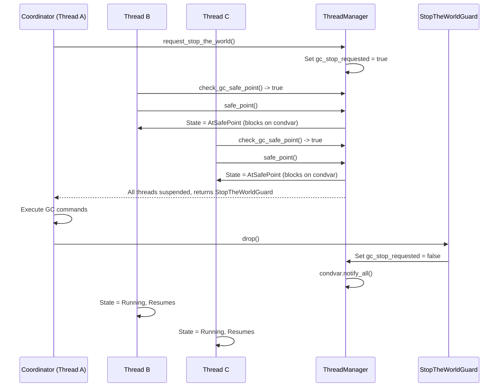

# Threading and Synchronization

This document describes the threading model, feature-gated implementations, monitor-style synchronization, and the coordination protocols between threads, GC, and static initialization.

## Overview

Threading is feature-gated with **two parallel implementations** that share a common trait interface:

| Feature          | Threading Module                  | Sync Module                            | Behavior                                                |
|------------------|-----------------------------------|----------------------------------------|---------------------------------------------------------|
| (none)           | `threading/stub.rs` (~72 lines)   | `sync/single_threaded.rs` (~151 lines) | No-op thread ops, no locking                            |
| `multithreading` | `threading/basic.rs` (~576 lines) | `sync/threaded.rs` (~320 lines)        | Real OS threads, monitor locks, and STW GC coordination |

## Thread Lifecycle (`threading/`)

### `ThreadManagerOps` Trait (`threading/mod.rs`)

Common interface implemented by both `basic::ThreadManager` and `stub::ThreadManager`. It uses a generic `Guard: STWGuardOps` to measure stop-the-world duration.

- `register_thread` / `register_thread_traced`: Assigns a managed `ArenaId` to the current OS thread.
- `unregister_thread` / `unregister_thread_traced`: Cleans up the thread state when it exits.
- `current_thread_id`: Returns the `ArenaId` for the calling thread, or `None` if unregistered.
- `thread_count`: Returns the number of currently active managed threads.
- `is_gc_stop_requested`: Returns `true` if a STW pause is pending. Checked at safe points.
- `safe_point` / `safe_point_traced`: Transitions the thread to `AtSafePoint`, waits for GC commands from the coordinator, and resumes when the STW pause ends.
- `execute_gc_command`: Dispatches a specific `GCCommand` (MarkAll, Sweep, etc.) to the local arena.
- `request_stop_the_world` / `request_stop_the_world_traced`: Initiates a STW pause, waiting until all threads are suspended. Returns a `Guard` that releases threads upon drop.

### Thread State Machine (`basic.rs`)

```
Running → AtSafePoint → (GC runs) → Running
Running → Suspended → Running
Running → Exited
```

- **`Running`**: Normal execution
- **`AtSafePoint`**: Thread has paused for GC, waiting for resume signal
- **`Suspended`**: Thread is explicitly suspended (e.g., `Thread.Sleep`)
- **`Exited`**: Thread has completed

### `ManagedThread` (`basic.rs`)
Each thread has:
- `native_id`: OS `ThreadId`
- `managed_id`: `ArenaId` (used as the thread's identity throughout the VM)
- Atomic `ThreadState`

### Stop-The-World Protocol (`basic.rs` → `request_stop_the_world`)

The Stop-The-World (STW) protocol synchronizes all managed threads to a halt so the `GCCoordinator` can safely trace and move objects.



1. **Initiation**: The acquiring thread calls `request_stop_the_world`, which acquires the main thread lock and sets `gc_stop_requested = true`. It records a `start_time` (`Instant::now()`).
2. **Synchronization**: It loops over all registered threads, waiting on a condition variable until every thread's state transitions to `AtSafePoint` (or is already `Suspended`/`Exited`).
3. **Execution**: Returns a `StopTheWorldGuard`. The coordinator now has exclusive access to the heap and issues commands via `execute_gc_command_for_current_thread`.
4. **Resumption**: When the `StopTheWorldGuard` is dropped, `gc_stop_requested` is cleared, and `resume_threads()` is called, which broadcasts a condition variable to wake all threads stuck in `safe_point`. The guard's `elapsed_micros()` provides the total pause timing.

### Stub Implementation (`stub.rs`)
- All operations are no-ops or return fixed values
- `is_gc_stop_requested` always returns `false`
- `safe_point` does nothing
- Compiles out all threading overhead for single-threaded mode

## Safe Points

Safe points are checked at:
- **Loop back-edges**: The `br` / `brtrue` / `brfalse` instructions targeting earlier offsets
- **Method calls**: Before pushing a new frame
- **Explicit checks**: `CallStack::check_gc_safe_point` in `dispatch/mod.rs`

### Safe Point ↔ BorrowGuard Interaction
When a `BorrowGuard` is active (borrow scope counter > 0), `check_gc_safe_point` returns early without blocking. This prevents deadlocks when a thread holds a GC borrow but the coordinator requests STW.

The path to thread suspension:
1. `check_gc_safe_point()` evaluates `ThreadManager::is_gc_stop_requested()`.
   - If a `BorrowGuard` is active (borrow scope counter > 0), it returns `false` to prevent deadlocks (since the thread cannot safely park while holding GC locks).
2. If `true`, the loop or instruction handler exits early (often returning `StepResult::Continue` without advancing IP, or completing a chunk of work).
3. The main execution loop in `crates/dotnet-vm/src/executor.rs` catches this, drops any transient locks, and explicitly calls `ThreadManagerOps::safe_point(thread_id, coordinator)`.
4. In `basic.rs`, `safe_point()` sets the thread state to `AtSafePoint`, notifies the STW coordinator, and blocks on a condition variable.
5. While blocked, it may be woken up to process a `GCCommand` (via `execute_gc_command_for_current_thread`) before going back to sleep.
6. Once the STW guard is dropped, the condition variable is pulsed, the state resets to `Running`, and execution resumes.

## Monitor Synchronization (`sync/`)

### `SyncManagerOps` and `SyncBlockOps` Traits (`sync/mod.rs`)

Implements .NET's `Monitor.Enter`/`Monitor.Exit` semantics (the `lock` keyword) and `wait`/`pulse` signals.

- `SyncManagerOps`:
  - `get_or_create_sync_block`: Lazily allocates a sync block index for an object layout.
  - `get_sync_block`: Retrieves an existing sync block by index.
  - `try_enter_block`: Attempts to acquire a block without waiting.
- `SyncBlockOps`:
  - `try_enter`: Non-blocking lock attempt.
  - `enter`: Blocking lock acquisition. Records contention metrics.
  - `enter_with_timeout`: Blocking lock with an explicit timeout.
  - `enter_safe`: Blocking lock with GC safe point awareness. Periodically yields to allow STW pauses.
  - `enter_with_timeout_safe`: Timed lock with GC safe points.
  - `exit`: Release the lock (decrements recursion count; unlocks if 0).
  - `wait` / `pulse` / `pulse_all`: Condition variable operations (Monitor.Wait/Pulse).

### Threaded Implementation (`sync/threaded.rs`, ~320 lines)

- **`SyncBlockManager` Data Structure**: Uses a `Mutex<HashMap<usize, Arc<SyncBlock>>>` mapping a unique index to a sync block, and an `AtomicUsize` for index generation.
- **`SyncBlock` Data Structure**: Contains a `Mutex<SyncBlockState>` and a `Condvar`.
- **`SyncBlockState`**: Tracks the `owner_thread_id` (`ArenaId`) and `recursion_count` to support re-entrant locking by the same thread.
- Objects are identified by their sync block index, stored in the object's header/layout.
- `enter_safe` uses a `loop` with `condvar.wait_for(10ms)`. Every 10ms, it wakes up, drops the lock, and calls `thread_manager.is_gc_stop_requested()` and `safe_point()` if necessary, preventing deadlocks when a thread waiting for a monitor lock is asked to suspend by the GC.

### Single-Threaded Implementation (`sync/single_threaded.rs`, ~151 lines)

- Tracks lock ownership for correctness checking but never actually blocks
- Detects re-entrant locks and recursive lock errors
- Useful for catching synchronization bugs in single-threaded testing

## Non-Obvious Connections

### Threading ↔ GC Coordinator
`ThreadManager` holds a `Weak<GCCoordinator>` (set via `set_coordinator`). The coordinator uses the thread manager to:
- Know which threads exist
- Wait for all threads to reach safe points
- Resume threads after collection

### Threading ↔ Static Initialization
`StaticStorageManager::wait_for_init` takes both a `ThreadManagerOps` and a `GCCoordinator`. While waiting for another thread's `.cctor`, the waiting thread must:
1. Check for GC safe point requests (so it doesn't block STW)
2. Check if the initializing thread has completed
This creates a three-way dependency: statics ↔ threading ↔ GC.

### Threading ↔ Executor
Each `Executor` owns a `GCArena` in thread-local storage. Thread creation (`threading/basic.rs`) spawns a new OS thread, which creates its own `Executor` and registers with the `ThreadManager`. The arena ID serves as both the GC arena identifier and the managed thread ID.

### SyncBlock ↔ Object Identity
Monitor locks are keyed by a lazily allocated sync block index stored in the object layout. This means:
- The GC can safely move objects without breaking sync blocks, as the object retains its index.
- Sync blocks can be dynamically allocated on demand.

### Feature Flag Interactions
- `multithreading`: Full multi-threaded execution with per-thread arenas, monitor locking, and STW coordination across arenas.
- The stub threading module compiles out ALL threading overhead, including atomic operations in some cases.

## Subsystem Details

### GC Command Processing (`execute_gc_command_for_current_thread`)
During a STW pause, the coordinator issues commands (like `MarkAll`, `MarkObjects`, `Finalize`, `Sweep`). Suspended threads briefly wake up to execute these commands locally via `execute_gc_command_for_current_thread` in `basic.rs`. They access their own heap using the thread-local `THREAD_ARENA` without needing global locks. Once the local arena command completes, the thread goes back to the `AtSafePoint` suspended state.

### Cross-Arena References (`record_found_cross_arena_refs`)
In a multi-arena GC, objects in one thread's arena might reference objects in another. During the `MarkAll` or `MarkObjects` phase, when a thread discovers a reference pointing outside its own arena, it logs it. `record_found_cross_arena_refs` takes these accumulated references and registers them with the central `GCCoordinator` so they can be pushed to the owning arena's root set in a subsequent marking iteration.

### Thread-Local Storage Patterns
- `THREAD_ARENA`: A thread-local `RefCell<Option<GCArena>>` storing the thread's local GC heap. Used to execute GC commands without lock contention.
- `MANAGED_THREAD_ID`: A thread-local `Cell<Option<ArenaId>>` in `dotnet_utils::sync`. Cached via `get_current_thread_id()` to avoid repeatedly querying the ThreadManager for identity.

### Architecture Routing (`SharedGlobalState`)
`ThreadManagerOps` is instantiated once and wrapped in an `Arc`. It is distributed throughout the VM by being embedded inside `SharedGlobalState`. Every `VesContext` has a reference to `SharedGlobalState`, granting all CIL instructions and BCL intrinsics access to threading and synchronization primitives.

### Utility Locks (`dotnet_utils::sync`)
The codebase uses a conditional aliasing pattern in `dotnet-utils/src/sync.rs` to abstract locking:
- **With `multithreading`**: Aliases point to `parking_lot::Mutex` and `parking_lot::RwLock`.
- **Without `multithreading`**: Aliases point to `compat::Mutex` and `compat::RwLock`, which are lightweight wrappers around `std::cell::RefCell` (bypassing OS locking overhead entirely).
*(Note: `ThreadSafeLock` was an earlier conceptual name for this pattern, now directly exposed as `RwLock`/`Mutex` aliases).*