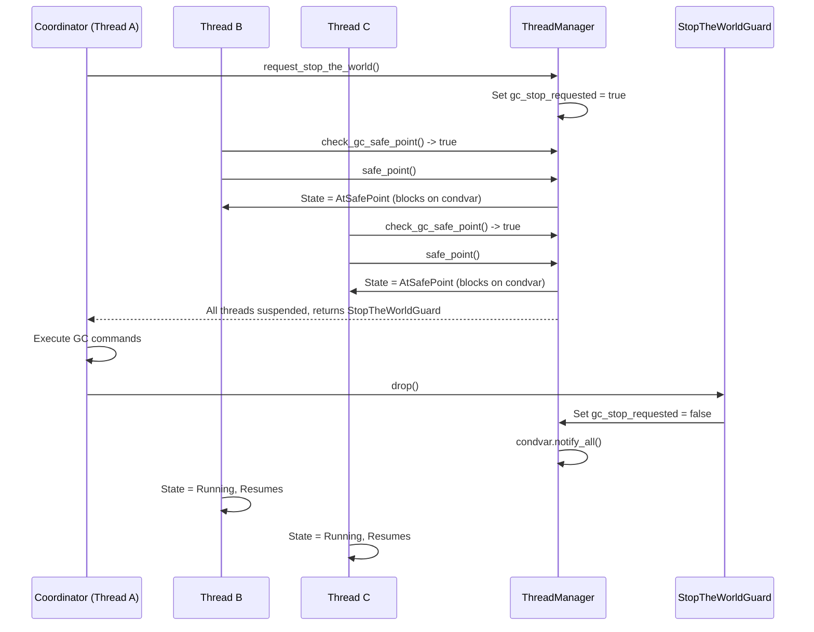

# Threading and Synchronization

This document describes the threading model, feature-gated implementations, monitor-style synchronization, and the coordination protocols between threads, GC, and static initialization.

## Overview

Threading is feature-gated with **two parallel implementations** that share a common trait interface:

| Feature          | Threading Module                  | Sync Module                            | Behavior                                                |
|------------------|-----------------------------------|----------------------------------------|---------------------------------------------------------|
| (none)           | `threading/stub.rs` (~72 lines)   | `sync/single_threaded.rs` (~151 lines) | No-op thread ops, no locking                            |
| `multithreading` | `threading/basic.rs` (~576 lines) | `sync/threaded.rs` (~320 lines)        | Real OS threads, monitor locks, and STW GC coordination |

## Thread Lifecycle (`threading/`)

### `ThreadManagerOps` Trait (`threading/mod.rs`)

Common interface implemented by both `basic::ThreadManager` and `stub::ThreadManager`. It uses a generic `Guard: STWGuardOps` to measure stop-the-world duration.

- `register_thread` / `register_thread_traced`: Assigns a managed `ArenaId` to the current OS thread.
- `unregister_thread` / `unregister_thread_traced`: Cleans up the thread state when it exits.
- `current_thread_id`: Returns the `ArenaId` for the calling thread, or `None` if unregistered.
- `thread_count`: Returns the number of currently active managed threads.
- `is_gc_stop_requested`: Returns `true` if a STW pause is pending. Checked at safe points.
- `safe_point` / `safe_point_traced`: Transitions the thread to `AtSafePoint`, waits for GC commands from the coordinator, and resumes when the STW pause ends.
- `execute_gc_command`: Dispatches a specific `GCCommand` (MarkAll, Sweep, etc.) to the local arena.
- `request_stop_the_world` / `request_stop_the_world_traced`: Initiates a STW pause, waiting until all threads are suspended. Returns a `Guard` that releases threads upon drop.

### Thread State Machine (`basic.rs`)

```
Running → AtSafePoint → (GC runs) → Running
Running → Suspended → Running
Running → Exited
```

- **`Running`**: Normal execution
- **`AtSafePoint`**: Thread has paused for GC, waiting for resume signal
- **`Suspended`**: Thread is explicitly suspended (e.g., `Thread.Sleep`)
- **`Exited`**: Thread has completed

### `ManagedThread` (`basic.rs`)
Each thread has:
- `native_id`: OS `ThreadId`
- `managed_id`: `ArenaId` (used as the thread's identity throughout the VM)
- Atomic `ThreadState`

### Stop-The-World Protocol (`basic.rs` → `request_stop_the_world`)

The Stop-The-World (STW) protocol synchronizes all managed threads to a halt so the `GCCoordinator` can safely trace and move objects.


```mermaid
sequenceDiagram
    participant Coordinator (Thread A)
    participant Thread B
    participant Thread C

    Coordinator (Thread A)->>ThreadManager: request_stop_the_world()
    ThreadManager->>ThreadManager: Set gc_stop_requested = true
    
    Thread B->>ThreadManager: check_gc_safe_point() -> true
    Thread B->>ThreadManager: safe_point()
    ThreadManager->>Thread B: State = AtSafePoint (blocks on condvar)
    
    Thread C->>ThreadManager: check_gc_safe_point() -> true
    Thread C->>ThreadManager: safe_point()
    ThreadManager->>Thread C: State = AtSafePoint (blocks on condvar)
    
    ThreadManager-->>Coordinator (Thread A): All threads suspended, returns StopTheWorldGuard
    
    Coordinator (Thread A)->>Coordinator (Thread A): Execute GC commands
    
    Coordinator (Thread A)->>StopTheWorldGuard: drop()
    StopTheWorldGuard->>ThreadManager: Set gc_stop_requested = false
    ThreadManager->>ThreadManager: condvar.notify_all()
    
    Thread B->>Thread B: State = Running, Resumes
    Thread C->>Thread C: State = Running, Resumes
```

1. **Initiation**: The acquiring thread calls `request_stop_the_world`, which acquires the main thread lock and sets `gc_stop_requested = true`. It records a `start_time` (`Instant::now()`).
2. **Synchronization**: It loops over all registered threads, waiting on a condition variable until every thread's state transitions to `AtSafePoint` (or is already `Suspended`/`Exited`).
3. **Execution**: Returns a `StopTheWorldGuard`. The coordinator now has exclusive access to the heap and issues commands via `execute_gc_command_for_current_thread`.
4. **Resumption**: When the `StopTheWorldGuard` is dropped, `gc_stop_requested` is cleared, and `resume_threads()` is called, which broadcasts a condition variable to wake all threads stuck in `safe_point`. The guard's `elapsed_micros()` provides the total pause timing.

**Panic guards**: `request_stop_the_world` arms a `ResumeOnPanic` guard before acquiring the thread lock; if a panic unwinds before `StopTheWorldGuard` is returned, `ResumeOnPanic::drop` calls `resume_threads()` so mutator threads are never permanently paused. During command execution inside `safe_point`, `CommandCompletionGuard` is typestated (`Armed`/`Disarmed`): armed drop signals `command_finished`, while `disarm(self)` transitions to a no-op drop state after the explicit manual completion signal.

### Stub Implementation (`stub.rs`)
- All operations are no-ops or return fixed values
- `is_gc_stop_requested` always returns `false`
- `safe_point` does nothing
- Compiles out all threading overhead for single-threaded mode

## Safe Points

Safe points are checked at:
- **Loop back-edges**: The `br` / `brtrue` / `brfalse` instructions targeting earlier offsets
- **Method calls**: Before pushing a new frame
- **Explicit checks**: `CallStack::check_gc_safe_point` in `dispatch/mod.rs`

### Safe Point ↔ GcScopeGuard Interaction
When a `GcScopeGuard` is active (GC scope counter > 0), `check_gc_safe_point` returns early without blocking. This prevents deadlocks when a thread holds GC-managed borrows but the coordinator requests STW.

The path to thread suspension:
1. `check_gc_safe_point()` evaluates `ThreadManager::is_gc_stop_requested()`.
   - If a `GcScopeGuard` is active (GC scope counter > 0), it returns `false` to prevent deadlocks (since the thread cannot safely park while holding GC locks).
2. If `true`, the loop or instruction handler exits early (often returning `StepResult::Continue` without advancing IP, or completing a chunk of work).
3. The main execution loop in `crates/dotnet-vm/src/executor.rs` catches this, drops any transient locks, and explicitly calls `ThreadManagerOps::safe_point(thread_id, coordinator)`.
4. In `basic.rs`, `safe_point()` sets the thread state to `AtSafePoint`, notifies the STW coordinator, and blocks on a condition variable.
5. While blocked, it may be woken up to process a `GCCommand` (via `execute_gc_command_for_current_thread`) before going back to sleep.
6. Once the STW guard is dropped, the condition variable is pulsed, the state resets to `Running`, and execution resumes.

## Monitor Synchronization (`sync/`)

### `SyncManagerOps` and `SyncBlockOps` Traits (`sync/mod.rs`)

Implements .NET's `Monitor.Enter`/`Monitor.Exit` semantics (the `lock` keyword) and `wait`/`pulse` signals.

- `SyncManagerOps`:
  - `get_or_create_sync_block`: Lazily allocates a sync block index for an object layout.
  - `get_sync_block`: Retrieves an existing sync block by index.
  - `try_enter_block`: Attempts to acquire a block without waiting.
- `SyncBlockOps`:
  - `try_enter`: Non-blocking lock attempt.
  - `enter`: Blocking lock acquisition. Records contention metrics.
  - `enter_with_timeout`: Blocking lock with an explicit timeout.
  - `enter_safe`: Blocking lock with GC safe point awareness. Periodically yields to allow STW pauses.
  - `enter_with_timeout_safe`: Timed lock with GC safe points.
  - `exit`: Release the lock (decrements recursion count; unlocks if 0).
  - `wait` / `pulse` / `pulse_all`: Condition variable operations (Monitor.Wait/Pulse).

### Threaded Implementation (`sync/threaded.rs`, ~320 lines)

- **`SyncBlockManager` Data Structure**: Uses a `Mutex<HashMap<usize, Arc<SyncBlock>>>` mapping a unique index to a sync block, and a `Mutex<usize>` for index generation.
- **`SyncBlock` Data Structure**: Contains a `Mutex<SyncBlockState>` and a `Condvar`.
- **`SyncBlockState`**: Tracks the `owner_thread_id` (`ArenaId`) and `recursion_count` to support re-entrant locking by the same thread.
- Objects are identified by their sync block index, stored in the object's header/layout.
- `enter_safe` uses a `loop` with a configurable yield interval (default 10ms). Periodically, it wakes up, drops the lock, and checks `thread_manager.is_gc_stop_requested()`. If a STW pause is pending, it returns `LockResult::Yield` without calling `safe_point()` directly — the caller converts this to `StepResult::Yield`, and the executor's main loop drives the safe-point handshake on the next iteration. This prevents deadlocks when a thread waiting for a monitor lock is asked to suspend by the GC.

#### `get_or_create_sync_block` two-step contract

`SyncBlockManager::get_or_create_sync_block` now takes `current_index: Option<usize>` and returns
`(new_index, Arc<SyncBlock>)`.

- The manager does all map/index allocation work internally while `SyncBlockManager::blocks` is
  locked.
- No external callbacks execute under `blocks`, so callers cannot accidentally re-enter sync-block
  APIs from inside a lock-held closure.
- Callers must publish `new_index` to object state only after `get_or_create_sync_block` returns
  (that is, after the manager lock has been released).

Current multithreaded call path:
`VesContext::monitor_get_or_create_sync_block_for_object`
(`crates/dotnet-vm/src/stack/context.rs`) reads the object's current index, calls
`get_or_create_sync_block(current_index)`, then publishes the returned index with
`object.set_sync_block_index(gc, new_index)` only after the call returns.

### Configuration

#### Environment Variables

| Variable | Default | Description |
|----------|---------|-------------|
| `DOTNET_SAFE_POINT_YIELD_MS` | `10` | The interval (in milliseconds) at which a thread waiting for a monitor lock will wake up to check for a GC safe point request. Lower values reduce GC pause latency but increase CPU overhead during lock contention. |

### Single-Threaded Implementation (`sync/single_threaded.rs`, ~151 lines)

- Tracks lock ownership for correctness checking but never actually blocks
- Detects re-entrant locks and recursive lock errors
- Useful for catching synchronization bugs in single-threaded testing

## Non-Obvious Connections

### Threading ↔ GC Coordinator
`ThreadManager` holds a `Weak<GCCoordinator>` (set via `set_coordinator`). The coordinator uses the thread manager to:
- Know which threads exist
- Wait for all threads to reach safe points
- Resume threads after collection

### Threading ↔ Static Initialization
`StaticStorageManager::wait_for_init` takes both a `ThreadManagerOps` and a `GCCoordinator`. While waiting for another thread's `.cctor`, the waiting thread must:
1. Check for GC safe point requests (so it doesn't block STW)
2. Check if the initializing thread has completed
This creates a three-way dependency: statics ↔ threading ↔ GC.

#### Wait-graph lifecycle invariant (`StaticStorageManager::wait_graph`)

The static-init deadlock detector is modeled as a per-thread edge map:
- `wait_graph[waiter] = owner` means thread `waiter` is currently waiting on `owner` to finish `.cctor`.

Lifecycle rules:
- `StaticStorageManager::init` inserts the edge before returning `StaticInitResult::Waiting`.
- `StaticStorageManager::wait_for_init` may refresh/update that edge as ownership changes while polling.
- `StaticStorageManager::wait_for_init` must remove `wait_graph[waiter]` on **every** return path.

The remove-on-all-returns rule is mandatory because `init` uses `causes_cycle()` over `wait_graph` before admitting another wait edge. A stale edge can create false-positive cycle detection and incorrectly force `StaticInitResult::Recursive`.

Call path:
- `VesContext::initialize_static_storage`
- `StaticStorageManager::init` returns `Waiting`
- `StaticStorageManager::wait_for_init` either:
1. returns `true` (caller yields `StepResult::Yield` and retries), or
2. returns `false` (caller re-checks final init state)

In both branches, `wait_graph` cleanup must already be complete before control returns to `initialize_static_storage`.

### Threading ↔ Executor
Each `Executor` owns a `GCArena` in thread-local storage. Thread creation (`threading/basic.rs`) spawns a new OS thread, which creates its own `Executor` and registers with the `ThreadManager`. The arena ID serves as both the GC arena identifier and the managed thread ID.

### SyncBlock ↔ Object Identity
Monitor locks are keyed by a lazily allocated sync block index stored in the object layout. This means:
- The GC can safely move objects without breaking sync blocks, as the object retains its index.
- Sync blocks can be dynamically allocated on demand.

### Feature Flag Interactions
- `multithreading`: Full multi-threaded execution with per-thread arenas, monitor locking, and STW coordination across arenas.
- The stub threading module compiles out ALL threading overhead, including atomic operations in some cases.

## Canonical Lock Order (Multithreading)

The lock order below is the canonical runtime contract for `feature = "multithreading"`.
Acquire locks only in the listed direction. Any reverse acquisition is a lock-order bug.

| Chain | Ordered locks | Observed call path(s) |
|-------|---------------|-----------------------|
| GC/STW top-level | `GCCoordinator::collection_lock` → `ThreadManager::gc_coordination` | `Executor::perform_full_gc` (`begin_collection` then `request_stop_the_world`) |
| STW bookkeeping | `ThreadManager::gc_coordination` → `ThreadManager::threads` | `ThreadManager::request_stop_the_world` (thread counts, warning dump) |
| GC command routing | `GCCoordinator::collection_lock` → `GCCoordinator::arenas` → `ArenaHandle::current_command` | `CollectionSession::{send_command_to_all_and_wait,wait_on_other_arenas,enqueue_command_for_arena}` |
| GC cross-arena table | `GCCoordinator::collection_lock` → `GCCoordinator::cross_arena_refs` | `CollectionSession::collect_all_arenas` |
| Static init deadlock detection | `StaticStorage::init_mutex` → `StaticStorageManager::wait_graph` | `StaticStorageManager::init` (`INIT_STATE_INITIALIZING` branch) |
| Monitor metadata allocation | `SyncBlockManager::blocks` → `SyncBlockManager::next_index` | `SyncBlockManager::get_or_create_sync_block` |
| Per-monitor ownership | `SyncBlock::state` is a leaf lock | `SyncBlock::{enter,enter_safe,exit}` |

### Forbidden Inversions

- For any path that needs both locks, acquire `GCCoordinator::collection_lock` before `ThreadManager::gc_coordination` (never the reverse).
- `ThreadManager::threads` must never be held while trying to acquire `ThreadManager::gc_coordination`.
- `GCCoordinator::arenas` or `ArenaHandle::current_command` must never be held while trying to acquire `GCCoordinator::collection_lock`.
- `ArenaHandle::current_command` must never be held while calling paths that take `GCCoordinator::arenas` (for example `get_arena`, `get_all_arenas`, `command_finished`).
- `StaticStorageManager::wait_graph` must never be held while acquiring `StaticStorage::init_mutex` (keep `wait_graph` updates short and non-blocking).
- `StaticStorageManager::wait_for_init` must remove `wait_graph[thread_id]` before every return (including GC-yield returns) to prevent stale-edge cycle false positives.
- `SyncBlockManager::next_index` must never be acquired before `SyncBlockManager::blocks`.
- Callers of `SyncBlockManager::get_or_create_sync_block` must publish the returned sync-block index only after the call returns (after `blocks` is released).
- `SyncBlock::state` must be dropped before any safe-point check (`is_gc_stop_requested` / `check_gc_safe_point`) to avoid blocking STW progress while waiting on monitor ownership.

## Subsystem Details

### GC Command Processing (`execute_gc_command_for_current_thread`)
During a STW pause, the coordinator issues commands (like `MarkAll`, `MarkObjects`, `Finalize`, `Sweep`). Suspended threads briefly wake up to execute these commands locally via `execute_gc_command_for_current_thread` in `basic.rs`. They access their own heap using the thread-local `THREAD_ARENA` without needing global locks. Once the local arena command completes, the thread goes back to the `AtSafePoint` suspended state. `CommandCompletionGuard<Armed>` wraps each command dispatch so panic paths still signal `command_finished`; normal paths call `disarm(self)` and then explicitly signal completion once.

### Cross-Arena References (`record_found_cross_arena_refs`)
In a multi-arena GC, objects in one thread's arena might reference objects in another. During the `MarkAll` or `MarkObjects` phase, when a thread discovers a reference pointing outside its own arena, it logs it. `record_found_cross_arena_refs` takes these accumulated references and registers them with the central `GCCoordinator` so they can be pushed to the owning arena's root set in a subsequent marking iteration.

Cross-arena discovery uses lease-guarded generation stamps:

- Recording path acquires `ArenaLease` with `try_acquire_lease(target_id)`.
- The discovered pointer is recorded as `(target_id, ptr, generation)`.
- Harvest path reacquires a lease and compares generations before dereference.
- `unregister_arena` waits for outstanding leases, so in-flight dereferences cannot race arena teardown.

### Thread-Local Storage Patterns
- `THREAD_ARENA`: A thread-local `RefCell<Option<GCArena>>` storing the thread's local GC heap. Used to execute GC commands without lock contention.
- `MANAGED_THREAD_ID`: A thread-local `Cell<Option<ArenaId>>` in `dotnet_utils::sync`. Cached via `get_current_thread_id()` to avoid repeatedly querying the ThreadManager for identity.

### Architecture Routing (`SharedGlobalState`)
`ThreadManagerOps` is instantiated once and wrapped in an `Arc`. It is distributed throughout the VM by being embedded inside `SharedGlobalState`. Every `VesContext` has a reference to `SharedGlobalState`, granting all CIL instructions and BCL intrinsics access to threading and synchronization primitives.

### Utility Locks (`dotnet_utils::sync`)
The codebase uses a conditional aliasing pattern in `dotnet-utils/src/sync.rs` to abstract locking:
- **With `multithreading`**: Aliases point to `parking_lot::Mutex` and `parking_lot::RwLock`.
- **Without `multithreading`**: Aliases point to `compat::Mutex` and `compat::RwLock`, which are lightweight wrappers around `std::cell::RefCell` (bypassing OS locking overhead entirely).
*(Note: `ThreadSafeLock` still exists in `dotnet-utils/src/gc/thread_safe_lock.rs` as a GC-specific lock wrapper that switches between `parking_lot::RwLock` (multi-threaded) and `gc_arena::RefLock` (single-threaded). The general-purpose `Mutex`/`RwLock` aliases in `dotnet-utils/src/sync.rs` are separate.)*

## Asynchronous Exceptions (Thread.Abort and Thread.Interrupt)

### Thread.Abort

Following the direction of modern .NET (.NET 5+ and .NET Core), `dotnet-rs` **does not support** `Thread.Abort`. 

- **Rationale**: `Thread.Abort` is inherently unsafe as it injects a `ThreadAbortException` at arbitrary execution points (asynchronous exceptions per ECMA-335 §I.12.4.2.3). This can interrupt static constructors, leave shared state in an inconsistent manner, or fail to release unmanaged resources.
- **Compliance**: While ECMA-335 §I.12.4.2.3 describes the mechanism for asynchronous exceptions, it does not mandate that a CLI implementation must provide a public `Thread.Abort` API.
- **Behavior**: Any attempt to call `Thread.Abort` via BCL will result in a `PlatformNotSupportedException`, consistent with modern .NET runtimes.

### Thread.Interrupt

`Thread.Interrupt` is currently **not implemented** in the `dotnet-rs` VM.

- **Status**: Unlike `Thread.Abort`, `Thread.Interrupt` is still supported in modern .NET for waking threads from waiting states (e.g., `Wait`, `Sleep`, `Join`). However, it has been omitted from the current implementation to maintain a simpler thread state machine.
- **Future Work**: Implementation would require tracking "interruptible" states and injecting a `ThreadInterruptedException` when the thread next enters or is already in a waiting state.

## Upstream Crate Contributor Notes

### `dashmap`: Deadlock Caveats (`len` / `iter_mut` / shard references)

**Source reference:** `dashmap 6.1.0`, `src/lib.rs:565-567, 723-725, 838-844`.

`DashMap` shards its data across a fixed set of `RwLock`-protected buckets. Several operations lock **all** shards simultaneously, which interacts dangerously with live shard references:

#### Self-deadlock rules
- **`DashMap::len()`** acquires a read lock on every shard in order to sum their lengths. If the calling thread already holds **any** shard reference on the same map (from `get()`, `get_mut()`, `entry()`, or a live iterator), calling `len()` will deadlock.
- **`DashMap::iter_mut()`** holds write locks on all shards for the duration of the iterator. No concurrent read or write to the map can proceed while the iterator is live. Do not hold an `iter_mut()` iterator across an `await` point or across a scope that calls back into the same map.
- **Shard reference lifetimes**: `Ref<'_, K, V>` and `RefMut<'_, K, V>` guards returned by `get()`/`get_mut()` hold a shard read/write lock. Always drop these guards before calling any full-map-locking method on the same `DashMap`.

#### Usage rules in this codebase
- All `DashMap` accesses in the VM (reflection caches, static storage, arena registry) use `get` / `insert` / `entry` and release the guard before any subsequent operation on the same map.
- **Never call `len()` while holding a `Ref` or `RefMut` from the same map.** If a count is needed for metrics or logging inside a code path that already holds a shard guard, capture the count before entering the guarded scope or use a separate `AtomicUsize` counter.
- When iterating with `iter()` or `iter_mut()`, complete the iteration and drop the iterator before calling `insert`, `remove`, `get`, or `len` on the same map.

---

### `crossbeam-channel`: Bounded vs Unbounded Behavior

**Source reference:** `crossbeam-channel 0.5.15`, `src/channel.rs:45-54, 106-126, 435-445, 812-838`.

`crossbeam-channel` offers two channel flavors with fundamentally different backpressure properties:

#### Unbounded channels (`unbounded()`)
- The sender **never blocks** and the channel grows without limit.
- Risk: a producer that outpaces the consumer will cause unbounded heap growth, eventually leading to OOM.
- **Do not introduce new unbounded channels** in hot VM paths (execution dispatch, GC, or tracing) without an explicit justification and a documented drop/trim policy.

#### Bounded channels (`bounded(n)`)
- The sender blocks on `send()` when the channel is at capacity, providing natural backpressure.
- `try_send()` returns `Err(TrySendError::Full(_))` immediately when full; the caller is responsible for the drop/retry policy.
- `try_recv()` returns `Err(TryRecvError::Empty)` immediately when the channel is empty.

#### Current usage in this codebase
- The tracer (`crates/dotnet-tracer/src/lib.rs`) uses a **bounded** channel with `TRACER_CHANNEL_CAPACITY = 8_192` and `try_send` on the hot path. Events dropped due to a full channel are counted in `dropped_by_backpressure` (`AtomicU64`) and reported as a `LogEntry::DroppedByBackpressure(u64)` summary entry in the flusher, so loss is always visible in logs.
- Any new diagnostic or inter-thread channel must use `bounded` with an explicit capacity and a documented policy for `TrySendError::Full` (drop-newest, drop-oldest, or block).
- **Never use `send()` (blocking) on a channel from the VM execution thread** — this stalls managed code execution and can interact with the STW safe-point protocol, potentially causing a deadlock if the receiver thread is itself waiting at a safe point.
- **`select!` with multiple bounded channels**: if all branches are full and no receiver is draining, the `select!` macro will block indefinitely. Prefer `try_send`/`try_recv` variants (`select!` with `default`) in hot paths.

---

### `parking_lot`: Condvar One-Mutex Rule and Fairness

**Source reference:** `parking_lot` (current pinned version), `Condvar` docs.

#### One-mutex rule (enforced at runtime)
`parking_lot::Condvar::wait(&self, guard: MutexGuard<'_, T>)` records the address of the mutex that issued the guard on the first `wait` call. **Every subsequent `wait` on the same `Condvar` must supply a guard from that exact same mutex.** Violating this rule causes an unconditional panic at runtime:

```
attempted to use a condition variable with two mutexes
```

Rules in this codebase:
- Each `Condvar` must be declared alongside its paired `Mutex` as a logical unit (e.g., in the same struct or adjacent `static`/field slots).
- **Never pass a guard from mutex A to a `Condvar` that was previously used with mutex B**, even if the types are identical. The coordinator's `collection_condvar` is permanently bound to `collection_lock`; the thread manager's `state_condvar` is permanently bound to `state_lock`.
- When refactoring: if a `Condvar` is moved to a new mutex, also reset (replace) the `Condvar` itself.

#### Fairness and notification semantics
`parking_lot::Mutex` uses a **fair** (queue-based) scheduling algorithm:
- Threads that have been waiting longer receive priority. This prevents starvation but slightly increases average lock-acquisition latency compared to an unfair spinlock.
- `Condvar::notify_one()` wakes the **longest-waiting** thread in the wait set, not an arbitrary one.
- `Condvar::notify_all()` wakes **all** waiting threads; each then races to re-acquire the paired mutex. Use this for broadcast scenarios (e.g., resuming all threads after a STW pause via `resume_threads()`).
- `parking_lot` mutexes do **not** support lock poisoning (unlike `std::sync::Mutex`). A thread that panics while holding a `parking_lot` mutex simply drops the guard normally; the mutex is released without poisoning. This is intentional — it matches the codebase's use of RAII cleanup guards and means `lock()` always returns a `MutexGuard` directly (no `LockResult` unwrapping needed).

#### Deadlock detection
`parking_lot` does **not** detect deadlocks by default. For debugging suspected deadlock scenarios, enable the `deadlock_detection` cargo feature of `parking_lot` locally and call `parking_lot::deadlock::check_deadlock()` from a background thread. Do not enable `deadlock_detection` in production or CI builds — it adds per-lock overhead.
